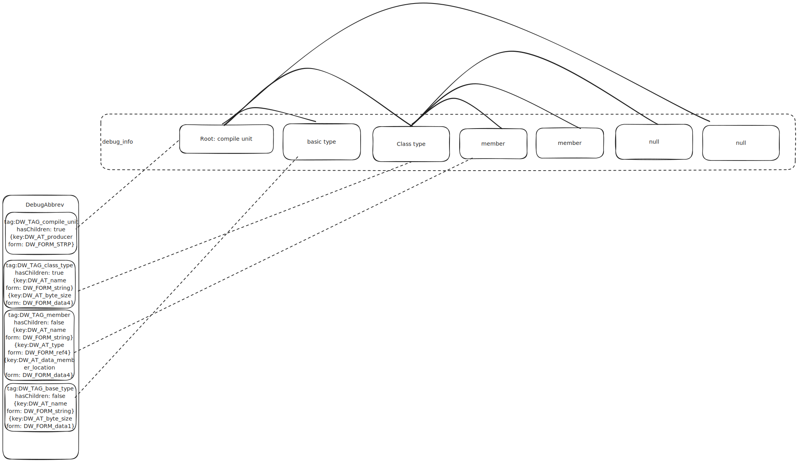

# Debug symbol layout

Currently debug symbols has two parts:

1. typescript source map file, which represents the mapping between source code and bytecode, this part is carried over from assemblyscript
2. Dwarf, which represents the class information, variable information.
   They are in following Wasm custom sections sections.
   - debug_info
   - debug_abbrev
   - debug_str

## Debug Abbreviation Definitions

### tag: DW_TAG_compile_unit

**hasChildren:** true

- `DW_AT_producer` -> `DW_FORM_strp`

### tag: DW_TAG_class_type

**hasChildren:** true

- `DW_AT_name` -> `DW_FORM_string`
- `DW_AT_byte_size` -> `DW_FORM_data4`
- `DW_AT_signature` -> `DW_FORM_data4` (runtime type ID)

### tag: DW_TAG_member

**hasChildren:** false

- `DW_AT_name` -> `DW_FORM_string`
- `DW_AT_type` -> `DW_FORM_ref4` (reference to type DIE)
- `DW_AT_data_member_location` -> `DW_FORM_data4` (offset in bytes)

### tag: DW_TAG_base_type

**hasChildren:** false

- `DW_AT_name` -> `DW_FORM_string`
- `DW_AT_byte_size` -> `DW_FORM_data1`

### tag: DW_TAG_template_type_parameter

**hasChildren:** false

- `DW_AT_type` -> `DW_FORM_ref4` (reference to type DIE)

### tag: DW_TAG_variable (Global)

**hasChildren:** false

- `DW_AT_name` -> `DW_FORM_string`
- `DW_AT_type` -> `DW_FORM_ref4` (reference to type DIE)

### tag: DW_TAG_variable (Local)

**hasChildren:** false

- `DW_AT_name` -> `DW_FORM_string`
- `DW_AT_type` -> `DW_FORM_ref4` (reference to type DIE)
- `DW_AT_location` -> `DW_FORM_data4` (Wasm local index)

### tag: DW_TAG_formal_parameter

**hasChildren:** false

- `DW_AT_name` -> `DW_FORM_string`
- `DW_AT_type` -> `DW_FORM_ref4` (reference to type DIE)
- `DW_AT_location` -> `DW_FORM_data4` (Wasm location index)

### tag: DW_TAG_subprogram

**hasChildren:** true

- `DW_AT_name` -> `DW_FORM_string`

### tag: DW_TAG_lexical_block

**hasChildren:** true

- `DW_AT_low_pc` -> `DW_FORM_addr` (start address)
- `DW_AT_high_pc` -> `DW_FORM_addr` (end address)

Topology dwarf debug symbol is 
